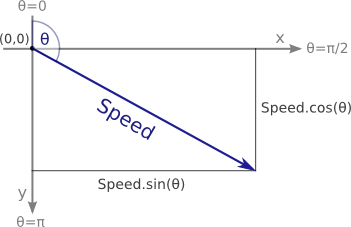
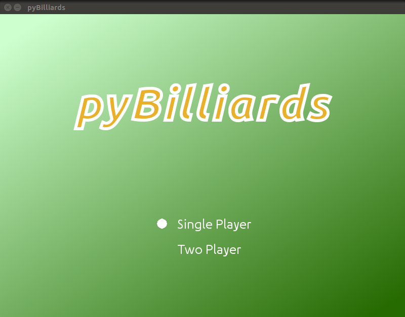
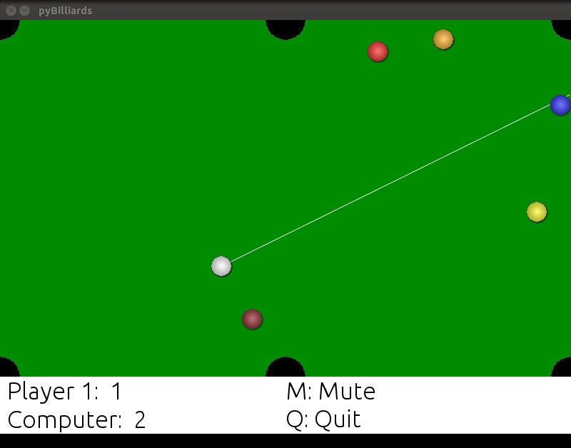

.. This is a comment. Note how any initial comments are moved by

   transforms to after the document title, subtitle, and docinfo.

================================
pyBilliards Game
================================

.. A Billiards game developed in python using pygame

.. bibliographic fields (which also require a transform):

:Course: AE: 663  Software Development Techniques for Engineering and Scientists
:Group No: 16
:Authors: Hardik Jasani, Rohan Ghige
:Contact: hardikj@iitb.ac.in, rohanghige@iitb.ac.in
:organization: IIT Bombay
:date: 30 April 2015
:github link: https://github.com/galop/pybilliards

This presentation gives a formal introduction to billiards game developed 
in pygame environment. We will put forth different methods and packages 
which we used on our way to achieve our goal.  

.. meta::
   :keywords: pygame, python

.. section-numbering::

---------

===================
Game Structure
===================

Different modes:

- Single player mode (Vs Computer)
- Two player mode

Features:

- Realtime ScoreBoard
- Sound ON/OFF toggle
- Cue ball speed bar
- Cue ball movement tracer
- Graphics Loading overlay surfaces

----------------

Game Modules
=============

Models and classes:

- Game Class
- Button Class
- Gameloop
- Balls Class
- pygame.mixer
  
Game Class:

- run()
- show_splash
- askmode()

---------------

Button Class:

- seton
- setoff
- toggle
- show

-----------------------

=================================
Game Physics: Co-ordinate System
=================================

.. figure:: col_2.jpg
   :width: 400px
   :align: right
   :alt: alternate text

This describes a collision between two balls.

-------------------------------------------------------

==============
Game Elements
==============

Cue ball movement:

- Cue trace-ball predctive co-ordinates taken
- Offset decrease in speed, to enhance gameplay.

Methods:

- ball.disp()
- ball.boundary()
- ball.collision()
- ball.move()
- ball.is_pocketed()
- balls.give_me_pocket_angles()

----------------

Other functions:

- show_table()
- find_nearest_ball()
- get_angle()
- cuepower()
- move_my_all_balls()

-----------------------------------

================================
Game Opening and option choice
================================

-------------------

====================
Game Console Display
====================

-------------------

====================
Thank You
====================

.. No Idea